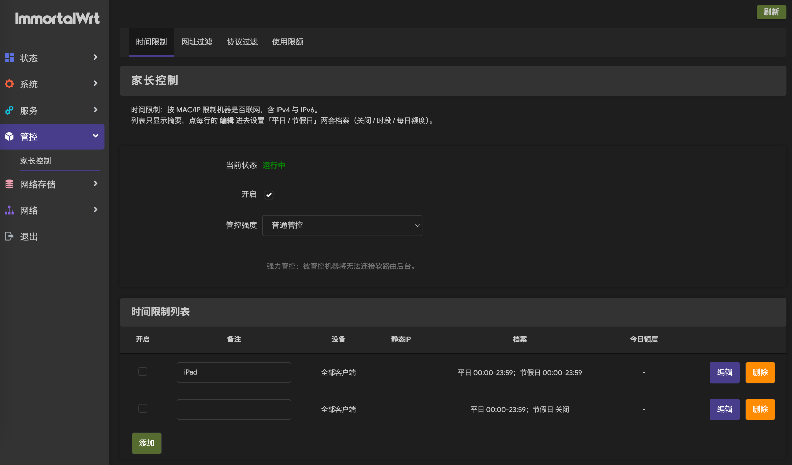
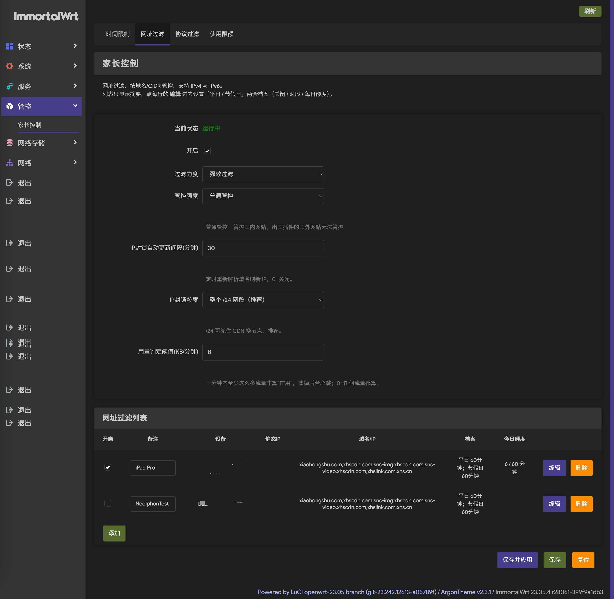
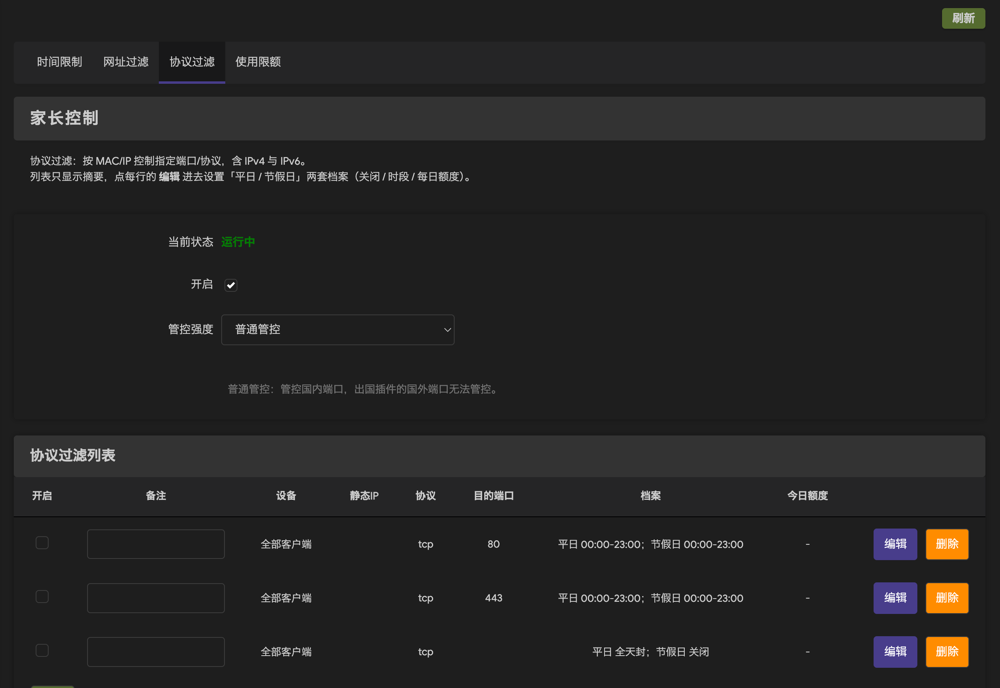
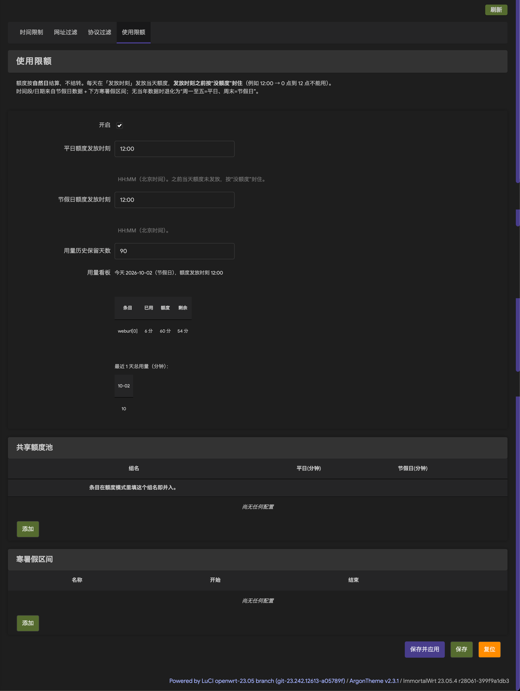

<h1 align="center">
  <br>luci-app-parentcontrol<br>
</h1>

<p align="center">
<a href="https://openwrt.org"></a>
<a href="https://www.google.com/chrome/"></a>
<a href="https://www.apple.com/safari/"></a>
<a href="https://www.mozilla.org/firefox/"></a>
</p>

家长控制：按时间控制机器、按端口/协议过滤、按网址过滤，并支持**每日累计使用额度**。


**上游原版在开启软件加速的 IPv4/IPv6 双栈环境下，「网址过滤」按 MAC 拦某个网站是完全不生效的**
（而且是静默失效：界面正常、iptables 不报错）。本 fork 把它修好了，并在此之上补上了：

- **每日累计使用额度**（用完即封、自然日结算、不结转）
- **平日 / 节假日双档案**（每份档案独立设「可用时段 + 每日额度」；额度填 0 = 全天禁止）
- **共享额度池**（多个条目共用一个额度）
- **法定节假日自动识别 + 寒暑假手动区间**
- **按 IP/CIDR 封锁 + 域名解析自动更新**（IPv4 只能这么封，见下）
- **防改 MAC**（静态 IP/主机名，与 MAC 任一命中即生效）
- **列表瘦身 + 详情独立编辑页**，列表显示「设备名 + 今日额度」

## 界面

<table>
<tr>
<td align="center" width="50%"><br><sub><b>时间限制</b>：按 MAC/IP 限制机器是否联网</sub></td>
<td align="center" width="50%"><br><sub><b>网址过滤</b>：按域名/CIDR 封锁（含过滤力度、IP 刷新间隔、封锁粒度、用量阈值）</sub></td>
</tr>
<tr>
<td align="center" width="50%"><br><sub><b>协议过滤</b>：按端口/协议限制</sub></td>
<td align="center" width="50%"><br><sub><b>使用限额</b>：共享额度池、寒暑假区间</sub></td>
</tr>
</table>

> 三个模块的列表**只显示摘要**：`设备（含设备名） / 档案（平日+节假日一句话） / 今日额度`，
> 点每行的 **编辑** 进独立页做详细设置。
> 更完整的用量统计（今天进度条、最近 30 天趋势、按条目/设备分析、重置记录）在
> **「使用统计」** 页 —— 截图 4 里的旧小看板已经移到那里了。


## 本 fork 的改动

### 1. 修复四处上游缺陷

1. `local Z1,Z2,...,Z7=0,...` 是 bash 语法，ash(busybox) 会报 `bad variable name` 并**中止整个脚本**，
   导致 time 之后 protocol/weburl 两组规则根本没被设置，还留下一个锁文件。
2. `del_rule` 里的 `$i -F $TAG` / `$TAGP` / `$TAGW` 是 `$ip` 的笔误，旧规则不会被清掉，规则不断堆叠。
3. `start()` 缺少陈旧锁判断：脚本一旦被中断，锁文件残留，此后每次 `start()` 都 exit 1，
   界面显示未运行却不报错。
4. `/etc/hotplug.d/iface/97-parentcontrol` 里 `[ "$(`uci -q get ...`)" == 1 ]` 把 `$( )` 和反引号套在一起，
   外层会把内层命令的**输出**当成命令执行（报 `1: not found`），条件恒为假 —— 脚本永远 exit 0，
   接口事件后从不重装规则。

### 2. 挂载点改到 mangle PREROUTING

原版挂在 `OUTPUT` 链，而 `-m mac --mac-source` 在 OUTPUT 里**永远不成立**
（路由器本机发出的报文没有源 MAC），所以「按 MAC 限制某台设备访问某网址」从来就没生效过。

改挂 mangle 表的 PREROUTING —— 只有这个位置同时能看到客户端源 MAC 和明文负载，
并且位于 flowtable 快转决策和其它组件 DNAT 之前。

### 3. 有受管设备时停用 flow offloading

fw4 会往 `forward` 链装一条 `meta l4proto { tcp, udp } flow add @ft`，把已建立的连接丢进
流卸载表；之后这条连接的报文在内核 ingress 快路径直接转发，**整个 netfilter 栈（含
mangle PREROUTING）都不再经过**，挂在 PREROUTING 上的规则自然也就失效了。

一开始想只把受管设备排除出去，写成 `ether saddr != <MAC> flow add @ft`，但**这个条件盖不住入方向**：
出方向源 MAC 是客户端，能排除；入方向（回包）的源 MAC 是上游网关、目的 MAC 此时还是路由器
自己的（LAN 侧的以太头是在 forward 钩子之后才写的）—— 于是**回包一进来就把整条流加进卸载表，
之后双向都绕过 netfilter**。

而且流一旦被卸载，**不会因为后来把规则拿掉就退出**（`nft delete flowtable` 报 `Resource busy`），
会一直漏到自然过期。表现出来就是「关掉列表再打开，封不住；设备息屏重连之后又好了」。

本 fork 的做法：**只要列表里还有受管设备（不管有没有勾选），就整条拿掉那条 `flow add` 规则**；
并用 `conntrack` 显式清掉受管设备现有连接，让它们重新握手、被 IP 封锁拦住。停用插件时自动恢复。

代价：只要列表里有受管设备，**全部设备的流卸载都是关闭的**（多走一遍 netfilter，x86 上通常无感）。
需要 `conntrack` 工具（`opkg install conntrack`）才能立即清掉旧连接。

### 4. 按 IP/CIDR 封锁 + 域名解析自动更新

**为什么必须有它：** 在那类设备上，**IPv4 转发报文的负载落在 skb 的 page frags 里，`-m string`
看不到它**。实测：一个带唯一标记的明文 HTTP GET，转发路径上数到 18 个包经过 `mangle PREROUTING`，
标记匹配 **0** 个（关掉 GRO 也一样）。所以「按关键词匹配 TLS SNI」对 **IPv4 转发流量完全无效**。
（IPv6 相反 —— 走隧道、解封装会把负载线性化，SNI 能匹配。）

**结论：IPv4 转发流量只能按目标 IP（报文头）来封。** 于是：

- `PARENTCONTROL_IP` 链（挂在 mangle PREROUTING）按解析出的目标 IP 封锁
- 网址行的「关键词/域名」列写域名即可：既当子串匹配明文 DNS / TLS SNI（apex 天然覆盖子域），
  也会被解析成 IP 一起封
- IPv4 默认封整个 `/24`（`basic.ip_mask` 可改 `32` 只封精确 IP）；IPv6 封 `/64`
- 解析同时取 apex 与 `www.` 两个变体（A 常在 apex、AAAA 常在 www）
- 列里**含 `/` 的项直接当 CIDR 封**，不解析（应急口子）
- 解析结果**按条目**累积在 `/etc/parentcontrol/ips/weburl_<N>`，只增不减 —— CDN 换节点后老节点
  仍被挡住
- cron 按 `basic.ip_refresh`（默认 30 分钟，`0`=关闭）调用 `refresh_ip` 刷新；crontab 条目由插件自己维护

### 5. 状态判定

- 「开启」开关勾着就显示运行中（列表全空只意味着没有规则去匹配，不等于没运行）
- 状态接口同时查 `mangle` 与 `filter` 两个表，只判断链是否存在

### 6. 每日额度（本 fork 的核心新增）

**计时口径：每个条目只算「它自己规则命中的流量」**
- 机器（时间）条目 = 该设备（MAC 或静态 IP）的**全部**流量
- 协议条目 = 该设备在**这组端口/协议**上的流量
- 网址条目 = 该设备发往**该条目目标**的流量：目标 IP **加上**明文 DNS(53) / TLS SNI(80,443) 命中的包

实现：额度条目在 mangle 建常开计数链 `PARENTCONTROL_ACCT`，命中即跳进空链 `PCA_<条目>`，
读跳转规则的字节计数；目标规则与「封锁规则」共用同一个生成器，保证两侧枚举的目标集合永不漂移。

**三态（按自然日、不结转）**
| 状态 | 时间 | 效果 |
|------|------|------|
| ① 时段外 | 00:00 – 24:00 中**不在**可用时段内的时刻 | 封（且这部分流量不计入额度） |
| ② 时段内 + 未用完 | 可用时段内且额度没用完 | 放行 |
| ③ 耗尽 | 额度用完（不论在不在时段内） | 封（立即切断） |

**全禁 = 额度填 0**：判定恒为 `封 = 不在时段内 或 已用 ≥ 额度`，N=0 时第二项恒成立，
不需要额外的开关。想永久禁掉某个 App/设备就用它。

- **可用时段**：每个档案自己一对（`sd_qstart`/`sd_qend`、`hd_qstart`/`hd_qend`），秒级 `HH:MM:SS`，
  默认 `00:00:00-23:59:59`（全天）；**不跨日**、起必须早于止
- **额度每天 0 点自然重置**（用量文件本来就按 `YYYYMMDD` 分文件），「发放时刻」这个设置已移除
- 勾 **不限额度**（`_unlimited=1`）→ 只受时段限制，额度框在界面上会隐藏
- 计时：cron 每分钟采样一次字节增量，**有流量且增量 ≥ `usage_min_kb`（默认 8 KB）**才记 1 分钟；
  同一分钟内多次流量只记 1 分钟
- 共享额度池：条目在档案里填同一个组名即并入（也可以自己不再填额度、完全交给池），组内流量加总、共用额度，组耗尽则所有成员一起封

### 7. 防自锁（重要）

额度耗尽的封锁规则在 mangle PREROUTING，**这个位置对「发往路由器自身」的流量同样生效** ——
一条「没填 MAC（= 全部客户端）」的额度条目一旦耗尽，会生成无条件 DROP，**把 SSH/LuCI 一起切断**，
只能上控制台救。为此做了两层保护：

1. `PARENTCONTROL_QUOTA` 链的**最前面**永远插入「到局域网网段 → RETURN」的放行规则
   （网段含路由器自身 IP，所以管理面不会被自己的封锁断掉）。实测本机没有 `addrtype` 模块，
   只能用目标网段放行。
2. 拿不到局域网网段时，**对「没填 MAC」的条目不封锁**（只记日志），宁可少封也不错封。
3. `start()` 用 `trap` 保证中途失败也会清掉锁文件。

### 8. 界面

- 三个模块的列表只显示摘要：`开启 / 备注 / 设备 / 静态IP /（协议另加 协议·端口）/ 档案 / 今日额度`，
  每行一个 **编辑** 按钮
  - **设备**列显示 `MAC（设备名）`，设备名取自 DHCP 租约/ARP（`luci.sys.net.mac_hints`）
  - **档案**列显示 `平日 30分钟 @kid1；节假日 08:00-18:00` 这样的摘要
  - **今日额度**列显示 `12 / 30 分钟`；勾了「不限额度」显示 `不限`；条目不存在时显示 `-`
- 点 **编辑** 进独立页（`weburl_edit` / `time_edit` / `protocol_edit`），容纳全部详细字段
- 新增「**使用限额**」页：共享额度池、寒暑假区间
- 插件内所有文案都是**中文字面量**（不受 LuCI 界面语言影响）

## 测试

仓库自带一套白盒测试（无需路由器，`sh` + `python3` 即可跑）：

```sh
sh test/run.sh             # 三个 lint + 三套测试（约 1 分钟）
sh test/common_test.sh     # 纯逻辑：日子判定/节假日解析/额度/配额/局域网网段
sh test/init_test.sh       # 规则构建：用状态化假 iptables 断言生成的规则
sh test/migrate_test.sh    # 配置迁移：week→双档案 / word→domains / 默认值
sh test/mutation_check.sh  # 变异测试（故意改坏源码，断言测试确实会失败）
```

`run.sh` 还会跑三个静态检查，都是**真机上踩过、主机测不出来**的坑：

- `lint_locals.py` —— shell 函数里赋值的 `_xxx` 必须 `local`。busybox ash 的变量默认全局，
  helper 里写 `_ip=$(...)` 会静默覆盖调用方的同名循环变量（真机上曾导致网址条目的
  **TCP/SNI 规则整条没被安装**）。
- `lint_ash.sh` —— 禁用 `10#` 等 busybox ash 不支持的写法（主机 bash/dash 支持，路由器上
  会 `arithmetic syntax error`，曾导致 `start` 崩、锁文件残留、crontab 永远写不进去）。
- `lint_luci_globals.py` —— 被 `require` 的 CBI 子模块不能直接用注入的全局类名 / `translate`
  （否则页面 500：`class must be a descendant of AbstractValue`）。

`test/fakes/` 下是桩：状态化 `iptables`/`ip6tables`（`-N/-F/-X/-C/-I/-A/-D/-S/-L` + 计数器）、
文件后端的 `uci`、可控的 `date`/`resolveip`/`wget`/`jsonfilter`/`crontab`。
关键路径（链名、挂载顺序、时限/额度阈值、跨天换档、采样记账、重建自愈、防自锁放行顺序）
都是直接断言生成的规则文本，而不是“跑通就算过”。

## 已知限制

- **网址类额度的计时在 IPv4 上只能靠目标 IP**：IPv4 转发报文负载内核看不到（见上），所以
  CDN 换到全新段时，封锁与计时会同时短暂漏掉，直到下一次刷新。机器类、协议类额度没有这个问题。
- **重复计一点**：一个包若同时命中「目标 IP 规则」和「字符串规则」会被计两次 —— 只有 SNI 握手包
  会重叠，量很小，对分钟级额度无影响。
- **计数只算一个方向**：与封锁同一方向（机器条目按源、网址条目按目的），回程/下载流量不计入。
  分钟级阈值下通常仍能触发（ACK 随下载量增长），但量级偏小。
- **用量阈值要按环境调**：默认 8 KB/分钟。心跳/通知通常 < 5 KB/分钟，真实一次访问 200 KB～数 MB。
  设太高会把「轻量但真实」的使用整段滤掉；设 `0` 则任何流量都算（后台推送也会耗额度）。
- **首次采样**：重建规则后第一次采样按「自规则建立以来的流量」判一次（修复了原先丢掉
  开机后那一段用量的问题）。
- **条目增删/排序后**，按索引记录的当日计数可能串台（`tblsection` 匿名索引的老毛病），跨天自愈。
- **LuCI 菜单文案有服务端缓存**：菜单标题来自 `/tmp/luci-indexcache*`（ucode 版文件名带哈希），
  升级/改文案后若界面仍是旧文字，清 `rm -f /tmp/luci-indexcache*` 并**关闭标签页重开**
  （普通刷新可能仍吃到浏览器里的旧副本）。
- **寒暑假没有全国数据源**：各省市分别公布、格式不统一，只能手动填区间（暑假可用 `MM-DD`
  每年重复，寒假用 `YYYY-MM-DD` 指定年份）。法定节假日/调休自动从
  [NateScarlet/holiday-cn](https://github.com/NateScarlet/holiday-cn) 拉取（jsDelivr 主、raw 备、
  包内自带离线兜底）。
- 不填域名时靠关键词猜（`关键词` → `关键词.com` / `www.关键词.com` / `关键词.cn`），只能覆盖主域名。
- QUIC(HTTP/3) 的 SNI 是加密的，任何 `-m string` 方案都拦不到；好在浏览器会自动回落 TCP。
- 客户端若用自带 HTTPDNS 的 App（IP 不来自系统 DNS），解析式封锁/计时覆盖不到它的 IP。

## 参数速查

| 配置 | 默认 | 说明 |
|------|------|------|
| `basic.enabled` | 0 | 总开关 |
| `basic.algos` | kmp | `-m string` 算法（bm=一般 / kmp=强效） |
| `basic.ip_refresh` | 30 | 重新解析域名刷新 IP 的间隔（分钟），`0`=关闭 |
| `basic.ip_mask` | 24 | IPv4 封锁粒度（`24` 兜 CDN / `32` 只封精确 IP） |
| `basic.usage_min_kb` | 8 | 每分钟至少多少 KB 才算「在用」 |
| `basic.usage_keep` | 90 | 用量历史保留天数 |
| 条目 `sd_*` / `hd_*` | — | 平日 / 节假日档案（**没有模式字段**）：`qstart`/`qend`(可用时段)、`quota`(**0 = 全天禁止**)、`unlimited`、`pool` |
| `quota.*` | — | 共享额度池：`name` + 平日/节假日额度 |
| `vacation.*` | — | 寒暑假区间：`name` + `start` + `end`（`MM-DD` 每年重复或 `YYYY-MM-DD` 绝对日期） |

时间口径：**日子类型、额度一律按北京时间（UTC+8）**，与路由器系统时区无关；
可用时段会按 UTC+8 换算成 UTC 再交给 `-m time`（该模块默认按 UTC 解释），因此也不依赖内核时区。
时段由内核精确到秒执行、不依赖 cron 是否在跑；额度那份封禁仍由每分钟的 tick 重建。

> **升级迁移**：新版本第一次启动会自动迁移一次。对**已经是新模型**的条目一个字段都不会动；
> 只有还带着老字段的条目才会被翻译（其中「老语义 = 不限」的那类必须强制改写开关，
> 否则翻译不过来）。每个老字段只翻译一次 —— 翻译完 `mode` 就被删除。
> - 老的「时段」模式（封某一段）→ **不限额度 + 可用时段 `09:00:00-21:00:00`**
>   （旧语义的补集跨日，新模型不支持跨日时段，无法无损换算，故统一给这个工作时段）
> - 老的「每日额度」模式 → 额度原样保留，**时段保持不设（= 全天可用）** —— 不会把原本 24 小时可用的条目静默收紧
> - 老的「关闭」→ 不限额度（全天可用）
> - 老的「每日额度」模式里，额度为**空 / 0 / 负数 / 非数字**（`"abc"`/`"00"`/`"+5"` 都会归一成 0）
>   的条目 → 按**额度模型引入以来的老判据**（`8ab43a2` 引入额度，到 `a0c7936` 之前每个版本
>   都是「归一后额度 > 0 才算有限额」；注意更早的版本并没有额度模型）视为
>   **不限额度**，并**强制改写**那个开关（老配置通常已带着一个无意义的 `unlimited=0`，
>   不强制就会把"不限"翻译成全天全禁）。
>   ⚠ 若你用过本仓库的**中间开发版**，有两种情况请复核（都与发布版语义不一样）：
>   1. **`a0c7936`**（曾短暂把「额度 0/空」当"全天禁止"）：这类条目**形状与老配置完全一样、
>      没有任何字段可区分**（试过拿 `week` 当时代标记，两个方向都会误判，已放弃），
>      迁移统一按**发布版语义**翻成「不限额度」。若你本来要的是全天禁止，请到编辑页把额度
>      填 `0` 并取消勾选「不限额度」。迁移日志 `/tmp/log/parentcontrol.log` 会写明哪些条目
>      被这样改写过。
>   2. **`f9c072b`**（曾给额度条目自动补上 `09:00-21:00` 时段）：本次迁移不会再动已经存在的
>      字段，那个时段会保留 —— 若不符合预期请自行在界面上调整。
> - 迁移完成后老字段（`mode`/`start`/`end`/`week`/`timestart`/`timeend`）会被清掉
>
> 迁移前会**自动备份**当前配置到 `/etc/parentcontrol/backup/parentcontrol.<时间戳>.bak`（迁移不可逆，请保留）。
> 迁移对**配置**是幂等的：重复执行不会产生任何新的配置变化（老字段第一次就被删干净了）。
> 每次执行都会另存一份备份文件，属预期。请按需在界面上调整。
