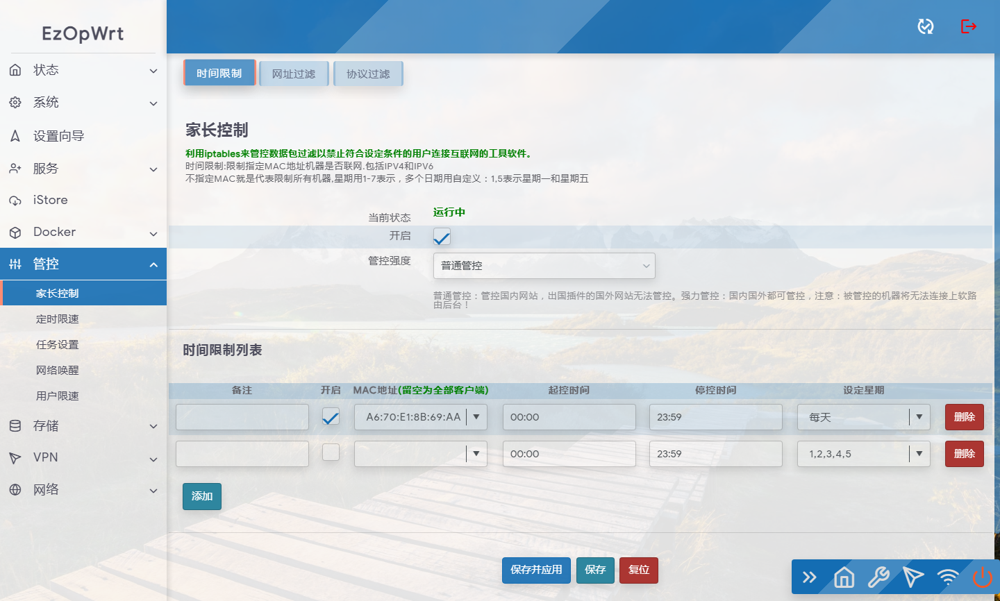
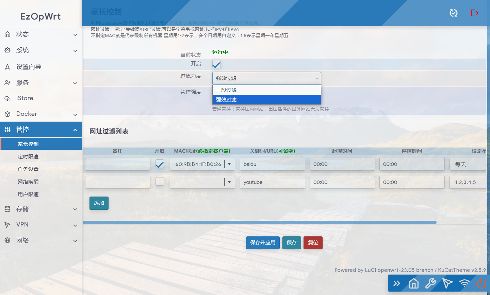
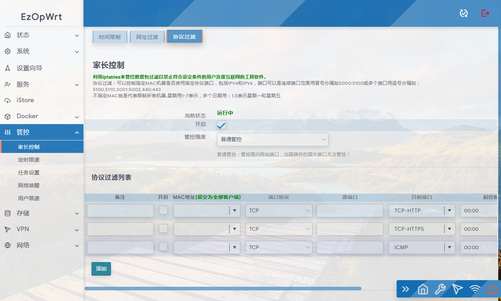

## 访问数：

<h1 align="center">
   luci-app-parentcontrol 
</h1>

https://github.com/sirpdboy/luci-app-parentcontrol

家长控制 ，可以按时间控制机器，端口和关键字过滤等。

本家长控制，是2022年群里某生找本人出钱定制界面开发，代码原来网上开源代码只是不符合要求，请本人二次开发，现经和需求方协议将代码开源！以感谢大家的支持与鼓励！！也算是为OPENWRT开源代码添砖加瓦！

当然，本身这代码也不是一个什么很高级的代码，权当是抛砖引玉，如果有什么不足之处，欢迎一起ISSE使之更完善。

最初版本参考Lienol大的网址过滤源码和参考部分网上开源代码而来。

参考来源：
https://github.com/Lienol/openwrt-package/tree/main/luci-app-control-weburl

## 界面

## 本 fork 的改动

> 上游原版在这类设备（OpenWrt/ImmortalWrt 23.05 + fw4 + passwall 的虚拟化软路由）上，
> 「网址过滤」按 MAC 拦某个网站是**完全不生效**的，而且是静默失效（界面正常、iptables 不报错）。
> 本 fork 修好了它。

### 1. 修复四处上游缺陷

1. `local Z1,Z2,...,Z7=0,...` 是 bash 语法，ash(busybox) 会报 `bad variable name` 并**中止整个脚本**，
   导致 time 之后 protocol/weburl 两组规则根本没被设置。
2. `del_rule` 里的 `$i -F $TAG` / `$TAGP` / `$TAGW` 是 `$ip` 的笔误，旧规则不会被清掉，规则不断堆叠。
3. `start()` 缺少陈旧锁判断：脚本一旦被中断，锁文件残留，此后每次 `start()` 都 exit 1，界面显示未运行却不报错。
4. `/etc/hotplug.d/iface/97-parentcontrol` 里 `[ "$(`uci -q get ...`)" == 1 ]` 把 `$( )` 和反引号套在一起，
   外层会把内层命令的**输出**当成命令执行，条件恒为假 —— 脚本永远 exit 0，接口事件后从不重装规则。

### 2. 挂载点改到 mangle PREROUTING

原版挂在 `OUTPUT` 链，而 `-m mac --mac-source` 在 OUTPUT 里**永远不成立**
（路由器本机发出的报文没有源 MAC），所以「按 MAC 限制某台设备访问某网址」从来就没生效过。
改挂 mangle 表的 PREROUTING —— 只有这个位置同时能看到客户端源 MAC、明文负载，
并且位于 flowtable 快转决策和其它组件 DNAT 之前。

### 3. 排除受管设备的 flow offload

fw4 会往 forward 链装一条 `meta l4proto { tcp, udp } flow add @ft`，把已建立连接丢进流卸载表；
之后这些连接的报文在内核 ingress 快路径直接转发，**整个 netfilter 栈都不再经过**。
用 `ether saddr != <受管 MAC>` 把它排除在卸载之外（只影响受管设备，不绕过任何防火墙规则）。

### 4. 新增按 IP/CIDR 封锁 + 域名解析自动更新

**为什么必须有它 —— 这是最坑的一点：**

在这类网卡直接收发报文的设备上，**IPv4 转发报文的负载落在 skb 的 page frags 里，`-m string` 看不到它**。
实测：一个带唯一标记的明文 HTTP GET，转发路径上数到 18 个包经过 `mangle PREROUTING`，标记匹配 **0** 个
（关掉 GRO 也一样）。所以「按关键词匹配 TLS SNI」对 **IPv4 转发流量完全无效**。
而 IPv6 走隧道、解封装会把负载线性化，所以 IPv6 那边 SNI 是能匹配到的。

**结论：IPv4 转发流量只能按目标 IP（报文头）来封 —— 头信息任何情况下都可见。**

于是新增：

- `PARENTCONTROL_IP` 链（mangle PREROUTING），按 MAC + 目标网段封 IPv4
- 网址过滤行新增 **「要解析封锁的域名」**（逗号分隔；留空则用关键词猜：`关键词` → `关键词.com` / `www.关键词.com` / `关键词.cn`）
- 用 `resolveip -4` 解析；默认封整个 `/24`（兜住 CDN 邻居节点和客户端 DNS 缓存里残留的旧节点），
  可通过 `basic.ip_mask` 改成 `32`（仅精确 IP）
- 解析结果累积在 `/etc/parentcontrol/ip.list`（**只增不减**，CDN 换节点后老节点依然被挡住），
  由 cron 按 `basic.ip_refresh`（默认 30 分钟，`0`=关闭）调用 `refresh_ip` 子命令定时刷新
- crontab 条目由插件自己维护（start 写入、stop 移除）

### 已知限制

- 不填 `domains` 时靠关键词猜域名，只能覆盖主域名；要覆盖 CDN 图片/视频域名，请显式填写子域。
- IP 封锁是「当前解析结果 + 历史累积」，CDN 若换到全新的 `/16`，需要等下一次刷新或手动补域名。
- QUIC(HTTP/3) 的 SNI 本身是加密的，任何 `-m string` 方案都拦不到；好在浏览器会自动回落 TCP。

# My other project

- 路由安全看门狗 ：https://github.com/sirpdboy/luci-app-watchdog
- 网络速度测试 ：https://github.com/sirpdboy/luci-app-netspeedtest
- 计划任务插件（原定时设置） : https://github.com/sirpdboy/luci-app-taskplan
- 关机功能插件 : https://github.com/sirpdboy/luci-app-poweroffdevice
- opentopd主题 : https://github.com/sirpdboy/luci-theme-opentopd
- kucat酷猫主题: https://github.com/sirpdboy/luci-theme-kucat
- kucat酷猫主题设置工具: https://github.com/sirpdboy/luci-app-kucat-config
- NFT版上网时间控制插件: https://github.com/sirpdboy/luci-app-timecontrol
- 家长控制: https://github.com/sirpdboy/luci-theme-parentcontrol
- 定时限速: https://github.com/sirpdboy/luci-app-eqosplus
- 系统高级设置 : https://github.com/sirpdboy/luci-app-advanced
- ddns-go动态域名: https://github.com/sirpdboy/luci-app-ddns-go
- 进阶设置（系统高级设置+主题设置kucat/agron/opentopd）: https://github.com/sirpdboy/luci-app-advancedplus
- 网络设置向导: https://github.com/sirpdboy/luci-app-netwizard
- 一键分区扩容: https://github.com/sirpdboy/luci-app-partexp
- lukcy大吉: https://github.com/sirpdboy/luci-app-lukcy

## 捐助

|       |    | 
| :-----------------: | :-------------: |
| |  |

